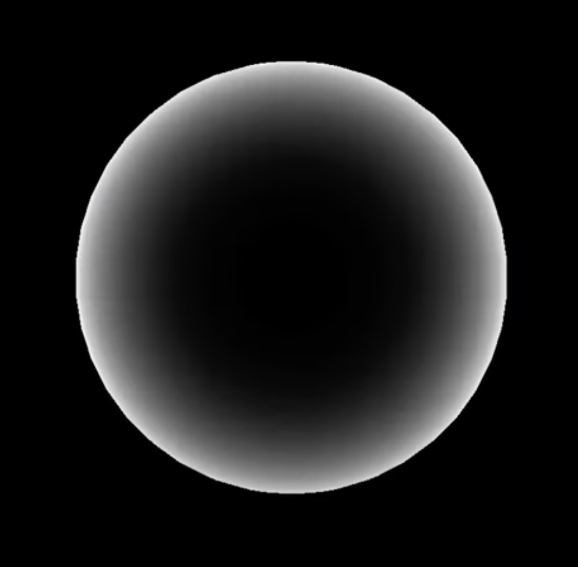

# bevy_shader_test

## RIM effect

Try to replicate the RIM effect on a sphere mesh using Bevy 0.13 and WGSL. The original demo was published on [youtube](https://www.youtube.com/watch?v=SiCNFMhDZ1o) and it was implemented in C++ and GLSL [vertex shader](https://github.com/chrischristakis/Winston-Shield/blob/master/shaders/bubble.vs) and [fragment shader](https://github.com/chrischristakis/Winston-Shield/blob/master/shaders/bubble.fs).
